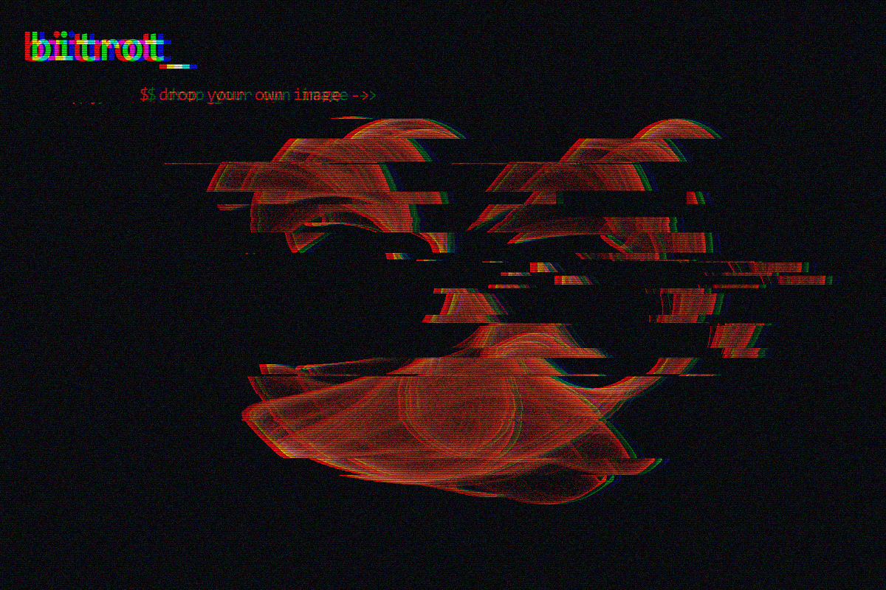

# BITROT_

**Break your pictures. Keep the evidence.** A free, browser-based glitch-art tool. Drop in a photo and corrupt it with a stack of reorderable layers: RGB splits, slice shifts, pixel sorting, datamosh smears and **real byte-level corruption** of the image data. Export as PNG, GIF or WebM. Vanilla HTML5 Canvas and JavaScript. Zero dependencies. Single file. Everything runs locally, so nothing is uploaded.



*Example output: the built-in demo attractor run through a glitch stack.*

**[Try it live](https://untruesudo.github.io/bitrot-canvas/)**

## ✨ Features

- **Layer stack** — add, reorder, duplicate, toggle and remove effect layers. Order matters: layers run top to bottom
- **12 effects** — RGB split, slice shift, block corruption, pixel sort, datamosh smear, byte corruption, wave, lens aberration, dither, scanlines, noise, tint
- **Pixel sorting** — sort runs of pixels by brightness or hue, horizontally or vertically, with adjustable thresholds
- **Datamosh smears** — stretch pixels into streaks, or drag and repeat blocks like a broken video frame
- **Byte-level corruption** — re-encodes the image as a JPEG, flips real bytes in the compressed data, then lets the browser decode the damage
- **Animated export** — record the glitch as a **GIF** (works in READMEs) or **WebM**, with adjustable length, frame rate, size and burst chance
- **Undo / redo** — every change is tracked (`Ctrl+Z` / `Ctrl+Y`)
- **Presets** — VHS tape, Heavy glitch, Pixel storm, Datamosh, Data rot, Forensic, Total corrupt, plus Randomize
- **Zine-style interface** — paper grain, hard offset shadows and big drag-to-change numbers instead of sliders. Three inks: Newsprint, Riso and Night press
- **Seeded and repeatable** — dragging a number tweaks the current glitch, *New damage* rolls a new one. Every look has a name that is exactly its seed, like "Rusted Signal 2339", so the same name with the same layers always gives the same glitch
- **Recipe links** — *Copy recipe link* stores the layers and seed in the URL, so anyone can apply your exact look to their own photo. The image itself is never included
- **Social-size exports** — crop to 1:1, 4:5, 9:16 story, 2:1 banner or 1.91:1 link card, with a dashed guide on the canvas. Works for PNG, GIF and WebM
- **Optional credit tag** — a small "BITROT_ · name · link" tag in the corner of exports. It is **on by default, has a large ON / OFF switch beside the Save button (and in the export dialog), and previews live on the image**. Turn it off and your exports stay clean
- **Hold to compare** — hold a button (or `Space`) to see the original, on desktop and touch
- **Stylish feedback** — a slam-in stamp announces presets and rolls
- **Private** — no upload, no server, no tracking

## 🚀 Usage

No install, no build step. Open `index.html` in any modern browser:

```bash
git clone https://github.com/untruesudo/bitrot-canvas.git
cd bitrot-canvas
# then open index.html in your browser
```

Or use it directly on GitHub Pages: **[untruesudo.github.io/bitrot-canvas](https://untruesudo.github.io/bitrot-canvas/)**

Load an image with **Open…**, by dragging it onto the page, or by pasting from the clipboard.

## 🎮 Controls

| Control | Description |
|---|---|
| Big numbers | Drag left or right to change a value (hold `Shift` for fine control), double-click to type, arrow keys to nudge |
| Square checkbox | Enable or disable a layer without removing it |
| Up / Down / Duplicate / Delete | Reorder, copy or remove a layer (click a layer's name to open it) |
| Add layer chips | Append a new layer of that type |
| New damage (`R`) | New random layout for the same layers |
| Surprise me | Build a random layer stack |
| Crop for | Choose a social size for exports; the dashed guide shows what will be kept |
| Credit tag ON / OFF | Adds or removes the small BITROT_ tag on exported files (remembered between visits) |
| Copy recipe link | Copy a link that rebuilds this look (layers and seed, no image) |
| Hold to compare | Show the original while held |
| Start from chips | Replace the stack with a ready-made preset |
| Animate | Live flicker with random corruption bursts |
| Ink swatches | Switch between the Newsprint, Riso and Night press themes |
| Make GIF / video | Render the animation to a file |
| Save PNG | Download the current frame |

## 🧩 Layers

| Layer | What it does |
|---|---|
| RGB split | Pushes the red and blue channels apart |
| Slice shift | Displaces horizontal bands sideways |
| Block corruption | Copies rectangles from elsewhere in the image, optionally inverted |
| Pixel sort | Sorts runs of pixels that fall inside a brightness range |
| Datamosh smear | Streaks or drags pixels in a chosen direction |
| Wave | Ripples the image sideways or up and down |
| Lens aberration | Splits colours outward from the centre |
| Dither | Crushes colours into a few levels with a retro screen pattern |
| Byte corruption | Damages the compressed JPEG bytes and re-decodes the result |
| Scanlines | Darkens every nth row, CRT style |
| Noise | Per-pixel grain |
| Tint | Recolors to rust, terminal green, amber or monochrome |

## 🧠 How it works

The source image lives on a hidden canvas. Each render copies its pixels, then runs every enabled layer in order, each with its own seeded random generator (mulberry32), so the glitch stays stable while you drag sliders and only *Re-roll* changes it. Most layers work directly on the raw pixel buffer. Byte corruption is the exception: it encodes the current pixels to JPEG, corrupts bytes after the start-of-scan marker while leaving JPEG markers intact, and decodes the damaged file. If the browser rejects a stream, it retries with fewer corrupted bytes. GIF export uses a small built-in encoder (median-cut palette and LZW compression) so no libraries are needed; WebM export uses the browser's `MediaRecorder`.

## 📄 License

MIT
